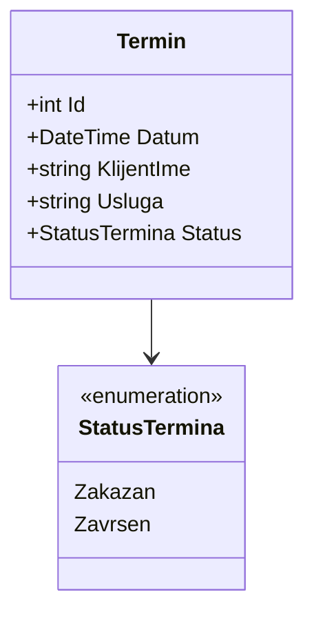

# Dijagram klasa

```mermaid
classDiagram
    class Termin {
        +int Id
        +DateTime Datum
        +string KlijentIme
        +string Usluga
        +StatusTermina Status
    }
    class StatusTermina {
        <<enumeration>>
        Zakazan
        Zavrsen
    }
    Termin --> StatusTermina
```

Svaki novi entitet se dodaje ovdje i commituje zajedno s kodom.
